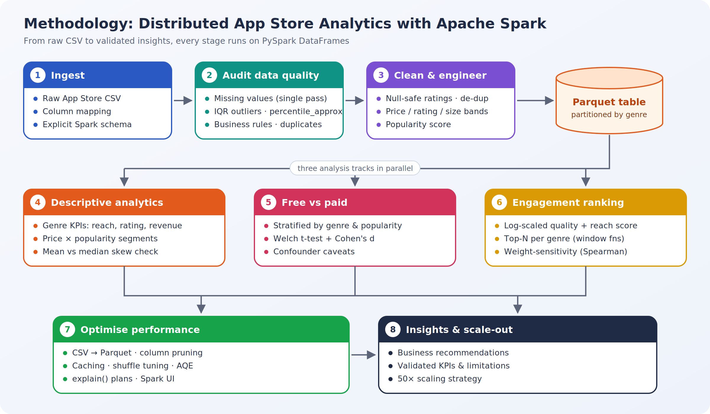
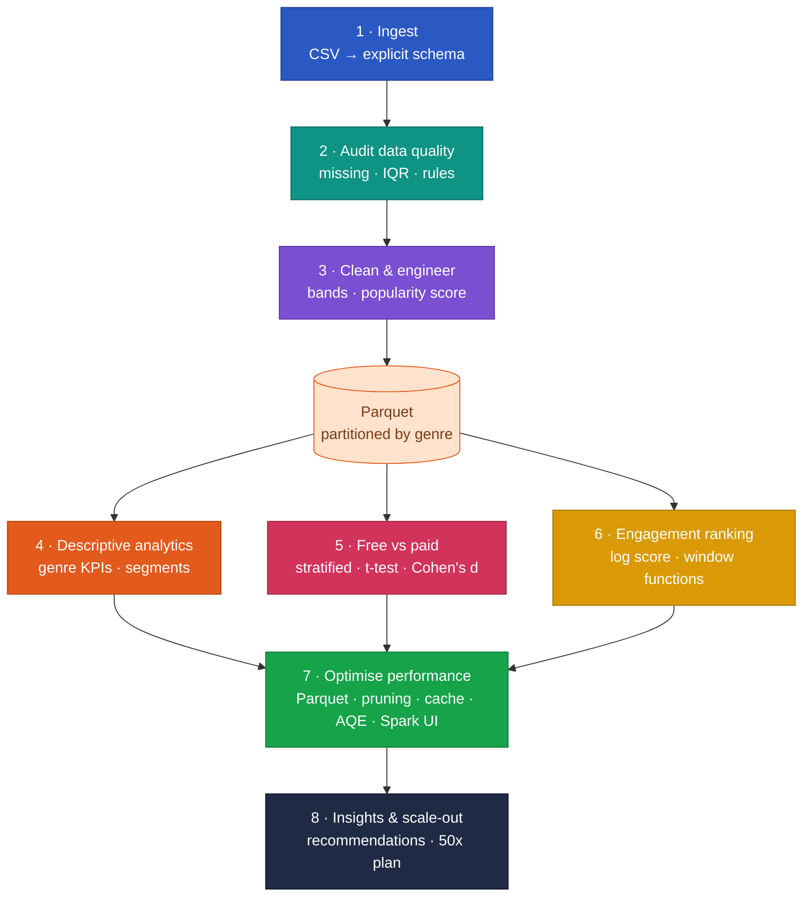

# Distributed App Store Analytics with Apache Spark


Scalable exploratory data analysis of Apple App Store apps with **PySpark**. The project builds a schema-enforced ingestion and data-quality pipeline, answers product questions about genres, pricing and engagement, and profiles Spark performance with **caching, column pruning, shuffle tuning, query plans and the Spark UI**.

> Built as part of the MSc Data Science programme (Applied Data Science 2), University of Hertfordshire.

---

## Business questions

| # | Question | Notebook |
|---|---|---|
| 1 | Which genres have the highest reach, ratings and monetisation potential? | `02` |
| 2 | How do price and app size relate to ratings and reach? | `02` |
| 3 | Are paid apps genuinely better rated than free apps once genre and popularity are controlled for? | `03` |
| 4 | Which apps lead each genre on a combined quality + reach engagement score? | `04` |
| 5 | Which Spark optimisations actually speed up a repeated analytics workload? | `05` |

## Methodology



**[Explore the interactive methodology](https://spoorthihs4-ops.github.io/app-store-analytics-spark/)** – click any stage to see what it does, why it matters and the Spark techniques behind it.

<details>
<summary><b>Pipeline as a live diagram (zoom and pan on GitHub)</b></summary>


</details>

## Notebooks

| Notebook | What it does | Key Spark techniques |
|---|---|---|
| [`01_data_ingestion_and_quality`](01_data_ingestion_and_quality.ipynb) | Loads the CSV, maps columns to a canonical schema, audits missing values, IQR outliers, business rules and duplicates, engineers features and writes Parquet | explicit `StructType`, single-pass aggregations, `percentile_approx`, Parquet |
| [`02_descriptive_analytics`](02_descriptive_analytics.ipynb) | Genre-level KPIs, price × popularity segmentation, price and size effects | `groupBy/agg`, `approxQuantile`, heatmaps |
| [`03_free_vs_paid_comparison`](03_free_vs_paid_comparison.ipynb) | Naive vs stratified comparison, Welch t-test and Cohen's d, validity caveats | `pivot`, stratification |
| [`04_engagement_score_and_ranking`](04_engagement_score_and_ranking.ipynb) | Log-scaled quality + reach score, top-N per genre, weight-sensitivity check | window functions (`row_number`, `percent_rank`) |
| [`05_performance_optimisation`](05_performance_optimisation.ipynb) | Benchmarks CSV vs Parquet, pruning, caching and shuffle tuning; reads physical plans; broadcast join; 50x scaling plan | AQE, `cache`, `explain("formatted")`, `broadcast`, Spark UI |

## Key design decisions

- **Fail loudly, never silently.** Missing input files or columns raise an error instead of falling back to demo data.
- **Unrated apps stay unrated.** Apps with zero reviews keep a `null` rating (filling with 0 would drag averages down) and are flagged with `is_rated`.
- **Outliers are kept and explained.** Heavy tails in `rating_count` and `price` are real market behaviour, handled with log-scaling and banding.
- **Fair comparisons.** Free-vs-paid results are stratified by genre and popularity and reported with effect sizes, not just p-values.
- **Honest benchmarking.** Each timing uses a warm-up run and the median of repeated runs on a multi-query workload.

## Results

| Metric | Value |
|---|---|
| Apps analysed | _fill in after running notebook 01_ |
| Genres | _fill in_ |
| Share of free apps | _fill in_ |
| Workload speed-up (baseline → pruned + cached + tuned) | _fill in from notebook 05_ |
| Parquet vs CSV full-scan speed-up | _fill in from notebook 05_ |

When the notebooks run, figures are saved to `reports/figures/`.

## How to run

### Google Colab (recommended)
1. Upload the dataset to Google Drive at `MyDrive/app-store-analytics-spark/data/raw/apple_appstore_apps.csv`.
2. Open any notebook in Colab (*File → Open notebook → GitHub*) and run all cells. Notebook `01` must run first; it creates the Parquet table used by `02`–`05`.
3. In notebook `05`, the Spark UI opens in a new tab for live job, stage and storage inspection.

### Locally
```bash
git clone https://github.com/spoorthihs4-ops/app-store-analytics-spark.git
cd app-store-analytics-spark
python -m venv .venv && source .venv/bin/activate
pip install -r requirements.txt          # requires Java 17+ for Spark
# place the CSV at data/raw/apple_appstore_apps.csv (or set APPSTORE_CSV=/path/to/file.csv)
jupyter notebook
```

## Dataset

Apple App Store apps metadata (app id, name, primary genre, price, average user rating, number of ratings, size, developer). The ingestion step accepts common column-name variants (for example `Average_User_Rating`/`Reviews`/`Size_Bytes`), so public Kaggle exports work without edits. The data is not stored in this repository.

## Repository structure

All files sit in the repository root so they upload and display correctly:

- `01_…` to `05_…ipynb` – the five analysis notebooks
- `methodology_flowchart.png` – methodology diagram
- `index.html` – interactive methodology page (GitHub Pages)
- `requirements.txt`, `.gitignore`

When the notebooks run, they create `data/raw/`, `data/processed/` and `reports/figures/` automatically.

## Author

**Dr. Spoorthi H S** · MSc Data Science, University of Hertfordshire  
[LinkedIn](https://linkedin.com/in/dr-spoorthi-2005b6351) · [GitHub](https://github.com/spoorthihs4-ops)
